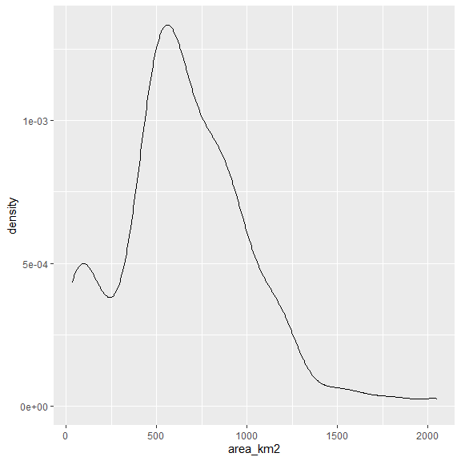
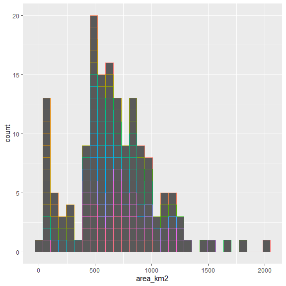
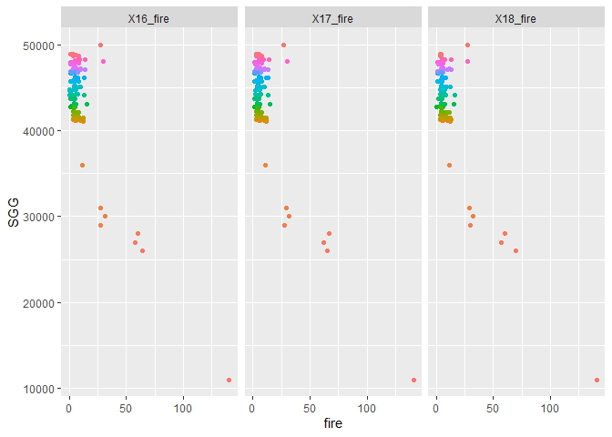
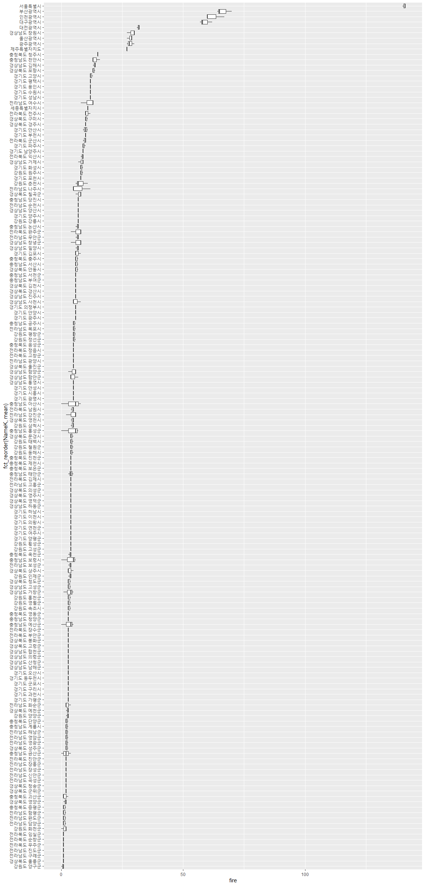
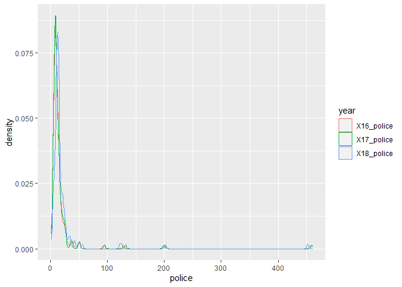
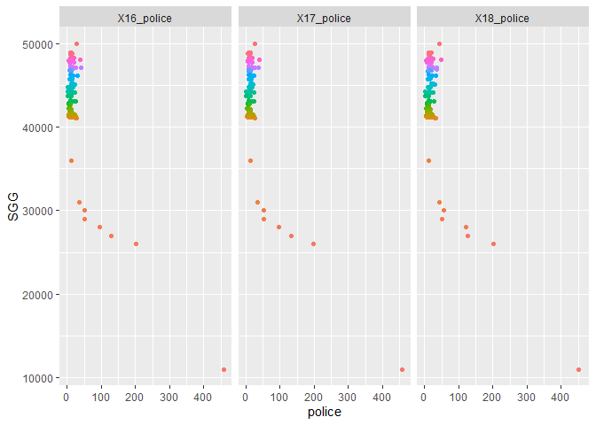
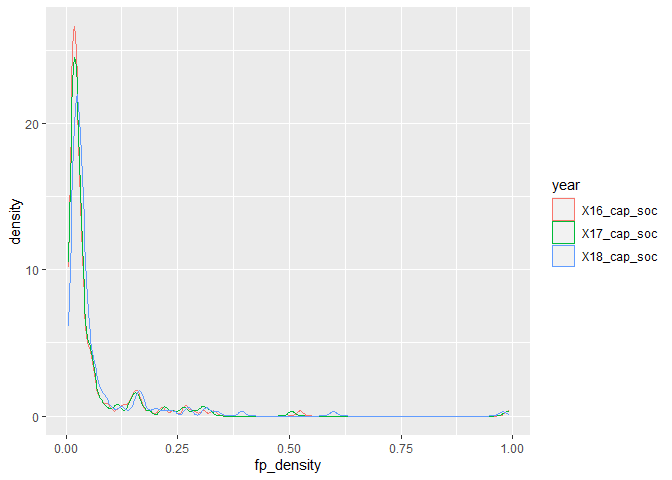
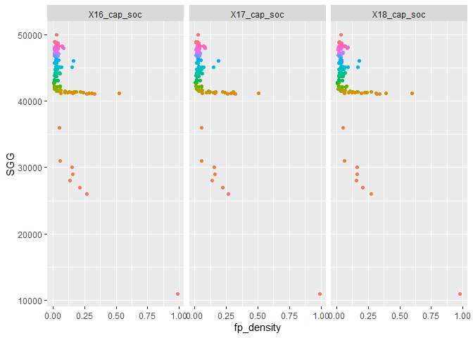
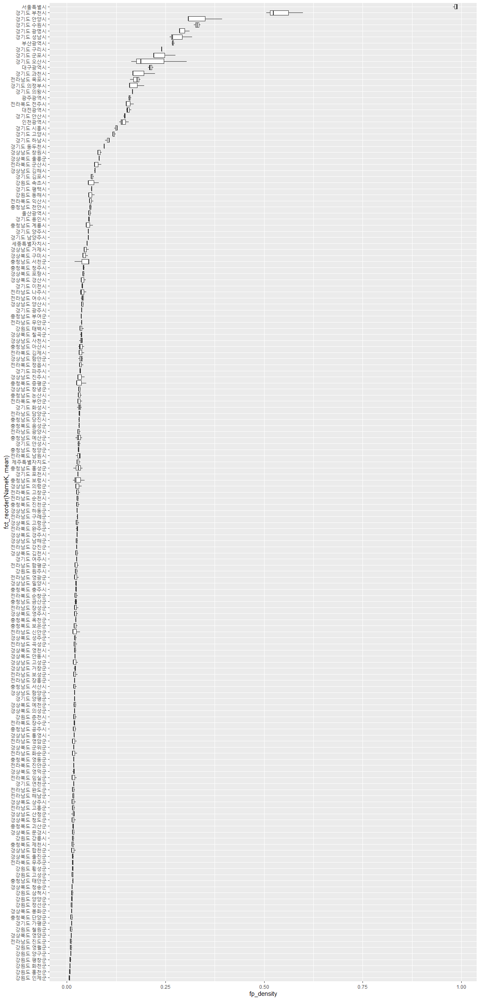

Capacity-소방/경창관서수밀도, 방재시설개수, 방재예산액
================
Kyungtak Kim
2020 3 26

``` r
# 패키지 설치
#install.packages("sf")
#install.packages("tmap")
#install.packages("dplyr")
```

``` r
library(tidyverse)
library(sf)
library(tmap)
Sys.setenv(Language="En")
library(caret)
library(knitr)
library(leaflet)
library(rgdal)
library(htmltools)
```

# 원본 데이터 읽기

``` r
DB <- as.data.frame(read.csv('input/capacity_db.csv'))
head(DB, 3)
```

    ##                   Name         NameK   SGG  area_km2 X16_cap_phy X16_fire
    ## 1 Gangwon Gangneung-si 강원도 강릉시 42150 1046.6571          20        7
    ## 2  Gangwon Goseong-gun 강원도 고성군 42820  661.4778          12        4
    ## 3   Gangwon Donghae-si 강원도 동해시 42170  198.1673          11        4
    ##   X16_police X16_ex_budget X16_main_budget X17_cap_phy X17_fire X17_police
    ## 1          8      11489640       324127632          27        7          8
    ## 2          5      24490167       324127632          12        4          5
    ## 3          7       9816380       324127632          11        4          7
    ##   X17_ex_budget X17_main_budget X18_cap_phy X18_fire X18_police X18_ex_budget
    ## 1       6073650       106612695          28        7         12       4698184
    ## 2      17998079       106612695          12        4          7       8487303
    ## 3       5047848       106612695          11        5          9       6956954
    ##   X18_main_budget
    ## 1        76670945
    ## 2        76670945
    ## 3        76670945

## 면적에 대한 분석 (area\_km2)

무슨 면적인가? 각 자치단체의 면적…

``` r
DB_a <- DB %>% 
  select(NameK, SGG, area_km2)
head(DB_a, 3)
```

    ##           NameK   SGG  area_km2
    ## 1 강원도 강릉시 42150 1046.6571
    ## 2 강원도 고성군 42820  661.4778
    ## 3 강원도 동해시 42170  198.1673

``` r
DB_a %>% 
  ggplot(aes(x=fct_reorder(NameK, area_km2),
             y=area_km2))+
  geom_point(aes(color=factor(SGG)))+
  coord_flip()+
  theme(legend.position = "none")
```

<!-- -->

``` r
DB_a %>% 
  ggplot(aes(area_km2))+
  geom_density()
```

<!-- -->

``` r
DB_a %>% 
  ggplot(aes(area_km2))+
  geom_histogram(aes(color=factor(SGG)))+
  theme(legend.position = "none")
```

    ## `stat_bin()` using `bins = 30`. Pick better value with `binwidth`.

<!-- -->

## 소방관서수에 대한 분석

``` r
DB_f <- DB %>% 
  select(NameK, SGG, contains("fire"))
head(DB_f, 3)
```

    ##           NameK   SGG X16_fire X17_fire X18_fire
    ## 1 강원도 강릉시 42150        7        7        7
    ## 2 강원도 고성군 42820        4        4        4
    ## 3 강원도 동해시 42170        4        4        5

``` r
DB_f_p <- DB_f %>%                           # pivoting
  pivot_longer(c("X16_fire", "X17_fire", "X18_fire"),
               names_to = "year",
               values_to = "fire")
DB_f_p %>% 
  ggplot()+
  geom_density(aes(x=fire, y=..density.., color=year))
```

<!-- -->

SGG는 시군 고유번호로 지역별 대략적인 분포를 알 수 있다.

``` r
DB_f_p %>% 
  group_by(year) %>% 
  ggplot(aes(fire, SGG))+
  geom_point(aes(color=factor(SGG)))+
  facet_grid(. ~year)+
  theme(legend.position = "none")
```

<!-- -->

``` r
DB_f_p %>% 
  group_by(NameK) %>% 
  mutate(mean=mean(fire))%>% 
  ggplot(aes(x=fct_reorder(NameK, mean),
             y=fire))+
  geom_boxplot()+
  coord_flip()
```

<!-- -->

## 경찰관서수에 대한 분석

``` r
DB_p <- DB %>% 
  select(NameK, SGG, contains("police"))
head(DB_p, 3)
```

    ##           NameK   SGG X16_police X17_police X18_police
    ## 1 강원도 강릉시 42150          8          8         12
    ## 2 강원도 고성군 42820          5          5          7
    ## 3 강원도 동해시 42170          7          7          9

``` r
DB_p_p <- DB_p %>%                           # pivoting
  pivot_longer(c("X16_police", "X17_police", "X18_police"),
               names_to = "year",
               values_to = "police")
DB_p_p %>% 
  ggplot()+
  geom_density(aes(x=police, y=..density.., color=year))
```

<!-- -->

SGG는 시군 고유번호로 지역별 대략적인 분포를 알 수 있다.

``` r
DB_p_p %>% 
  group_by(year) %>% 
  ggplot(aes(police, SGG))+
  geom_point(aes(color=factor(SGG)))+
  facet_grid(. ~year)+
  theme(legend.position = "none")
```

<!-- -->

``` r
DB_p_p %>% 
  group_by(NameK) %>% 
  mutate(mean=mean(police))%>% 
  ggplot(aes(x=fct_reorder(NameK, mean),
             y=police))+
  geom_boxplot()+
  coord_flip()
```

<!-- -->

# 연도별 (소방관서수+경찰서수) 밀도 산정

``` r
result_s1 <- as.data.frame(matrix(nrow = 0, ncol = 1))
result_s2 <- as.data.frame(matrix(nrow = 0, ncol = 1))
result_s3 <- as.data.frame(matrix(nrow = 0, ncol = 1))
for(i in 1:161){
  work1 <- as.data.frame((DB$X16_fire[i]+DB$X16_police[i])/DB$area_km2[i])
  result_s1 <- rbind(result_s1, work1)
  work2 <- as.data.frame((DB$X17_fire[i]+DB$X17_police[i])/DB$area_km2[i])
  result_s2 <- rbind(result_s2, work2)
  work3 <- as.data.frame((DB$X18_fire[i]+DB$X18_police[i])/DB$area_km2[i])
  result_s3 <- rbind(result_s3, work3)
}
result_soc <-cbind(result_s1, result_s2, result_s3)
colnames(result_soc) <- c("X16_cap_soc","X17_cap_soc","X18_cap_soc")
head(result_soc,3)
```

    ##   X16_cap_soc X17_cap_soc X18_cap_soc
    ## 1  0.01433134  0.01433134  0.01815303
    ## 2  0.01360590  0.01360590  0.01662943
    ## 3  0.05550865  0.05550865  0.07064737

## (소방관서수+경찰관서수)밀도에 대한 분석

``` r
result_soc1 <- cbind(DB[,2:3], result_soc) 
head(result_soc1, 3)
```

    ##           NameK   SGG X16_cap_soc X17_cap_soc X18_cap_soc
    ## 1 강원도 강릉시 42150  0.01433134  0.01433134  0.01815303
    ## 2 강원도 고성군 42820  0.01360590  0.01360590  0.01662943
    ## 3 강원도 동해시 42170  0.05550865  0.05550865  0.07064737

``` r
result_soc1_p <- result_soc1 %>%                           # pivoting
  pivot_longer(c("X16_cap_soc", "X17_cap_soc", "X18_cap_soc"),
               names_to = "year",
               values_to = "fp_density")
result_soc1_p %>% 
  ggplot()+
  geom_density(aes(x=fp_density, y=..density.., color=year))
```

<!-- -->

SGG는 시군 고유번호로 지역별 대략적인 분포를 알 수 있다.

``` r
result_soc1_p %>% 
  group_by(year) %>% 
  ggplot(aes(fp_density, SGG))+
  geom_point(aes(color=factor(SGG)))+
  facet_grid(. ~year)+
  theme(legend.position = "none")
```

<!-- -->

``` r
result_soc1_p %>% 
  group_by(NameK) %>% 
  mutate(mean=mean(fp_density))%>% 
  ggplot(aes(x=fct_reorder(NameK, mean),
             y=fp_density))+
  geom_boxplot()+
  coord_flip()
```

<!-- -->

``` r
# 연도별 방재예산액 산정
DB_eco <- as.data.frame(substr(DB$SGG,1,2))
colnames(DB_eco) <- c("code")
DB_eco <- cbind(DB_eco,DB[,c(8,9,13,14,18,19)])
name<-unique(DB_eco$code)

cap_eco <- function(x,y){
  return(x+(x/sum(x))*y)
}

result_e1 <- as.data.frame(matrix(nrow = 0, ncol = 1))
result_e2 <- as.data.frame(matrix(nrow = 0, ncol = 1))
result_e3 <- as.data.frame(matrix(nrow = 0, ncol = 1))  
for(i in 1:17){
  work <- as.data.frame(DB_eco[DB_eco$code==name[i],])
  work1 <- as.data.frame(cap_eco(work[,2],work[,3]))
  result_e1 <- rbind(result_e1,work1)
  work2 <- as.data.frame(cap_eco(work[,4],work[,5]))
  result_e2 <- rbind(result_e2,work2)
  work3 <- as.data.frame(cap_eco(work[,6],work[,7]))
  result_e3 <- rbind(result_e3,work3)
}
result_eco <-cbind(result_e1, result_e2, result_e3)
colnames(result_eco) <- c("X16_cap_eco","X17_cap_eco","X18_cap_eco") 


# 연도별 Capacity 지표 데이터 생성
DB_final <-cbind(DB[,c(5,10,15)],result_soc,result_eco)


# Capacity 지표별 root 표준화 함수 설정
standard_root <- function(x){
  return((sqrt(x)-min(sqrt(x)))/(max(sqrt(x))-min(sqrt(x))))
}


# 연도별 데이터 프레임에 root 표준화 적용
capacity <- as.data.frame(lapply(DB_final[,1:9],standard_root))
capacity <- cbind(DB[,1:3], capacity)
colnames(capacity)[4:12] <- c("X16_cap_phy_root", "X17_cap_phy_root", "X18_cap_phy_root","X16_cap_sco_root", "X17_cap_sco_root", "X18_cap_sco_root", "X16_cap_eco_root", "X17_cap_eco_root", "X18_cap_eco_root")


# 16년~18년 Capacity 지수 산정
cap_index_16 <- as.data.frame((rowSums(capacity[,c(4,7,10)]))/3)
colnames(cap_index_16) <- c("X16_cap_index")
cap_index_17 <- as.data.frame((rowSums(capacity[,c(5,8,11)]))/3)
colnames(cap_index_17) <- c("X17_cap_index")
cap_index_18 <- as.data.frame((rowSums(capacity[,c(6,9,12)]))/3)
colnames(cap_index_18) <- c("X18_cap_index")
capacity <- cbind(capacity, c(cap_index_16,cap_index_17,cap_index_18))


# Capacity 지수 표준화 함수 및 반전 함수 설정
standard <- function(x){
  return((x-min(x))/(max(x)-min(x)))
}

standard_reverse <- function(x){
  return(1-x)
}


# 연도별 Capacity 지수 표준화(반전) 산정
result_final <- as.data.frame(lapply(capacity[,13:15],standard))
result_final <- as.data.frame(lapply(result_final[,1:3],standard_reverse))
colnames(result_final) <- c("X16_capacity", "X17_capacity", "X18_capacity")
result_final <- cbind(DB[,1:3], result_final)


# 시군 shp 파일 불러오기
library(sf)
analysis <- st_read("input/analysis.shp")
```

    ## Reading layer `analysis' from data source `C:\00_R\0_Git\KRM_inha\input\analysis.shp' using driver `ESRI Shapefile'
    ## Simple feature collection with 161 features and 3 fields
    ## geometry type:  MULTIPOLYGON
    ## dimension:      XY
    ## bbox:           xmin: 746109.3 ymin: 1458771 xmax: 1387956 ymax: 2068444
    ## proj4string:    +proj=tmerc +lat_0=38 +lon_0=127.5 +k=0.9996 +x_0=1000000 +y_0=2000000 +ellps=GRS80 +units=m +no_defs

``` r
# 폴리곤 에러 체크(기존 shp 파일을 에러 수정한 파일로 변경하였음)
#st_is_valid(analysis)
#library(lwgeom)
#analysis <- st_make_valid(analysis)
st_is_valid(analysis)
```

    ##   [1] TRUE TRUE TRUE TRUE TRUE TRUE TRUE TRUE TRUE TRUE TRUE TRUE TRUE TRUE TRUE
    ##  [16] TRUE TRUE TRUE TRUE TRUE TRUE TRUE TRUE TRUE TRUE TRUE TRUE TRUE TRUE TRUE
    ##  [31] TRUE TRUE TRUE TRUE TRUE TRUE TRUE TRUE TRUE TRUE TRUE TRUE TRUE TRUE TRUE
    ##  [46] TRUE TRUE TRUE TRUE TRUE TRUE TRUE TRUE TRUE TRUE TRUE TRUE TRUE TRUE TRUE
    ##  [61] TRUE TRUE TRUE TRUE TRUE TRUE TRUE TRUE TRUE TRUE TRUE TRUE TRUE TRUE TRUE
    ##  [76] TRUE TRUE TRUE TRUE TRUE TRUE TRUE TRUE TRUE TRUE TRUE TRUE TRUE TRUE TRUE
    ##  [91] TRUE TRUE TRUE TRUE TRUE TRUE TRUE TRUE TRUE TRUE TRUE TRUE TRUE TRUE TRUE
    ## [106] TRUE TRUE TRUE TRUE TRUE TRUE TRUE TRUE TRUE TRUE TRUE TRUE TRUE TRUE TRUE
    ## [121] TRUE TRUE TRUE TRUE TRUE TRUE TRUE TRUE TRUE TRUE TRUE TRUE TRUE TRUE TRUE
    ## [136] TRUE TRUE TRUE TRUE TRUE TRUE TRUE TRUE TRUE TRUE TRUE TRUE TRUE TRUE TRUE
    ## [151] TRUE TRUE TRUE TRUE TRUE TRUE TRUE TRUE TRUE TRUE TRUE

``` r
# shp파일에 연도별 Capacity 지수(표준화 적용) 추가
library(dplyr)
analysis <- right_join(analysis, result_final[,3:6])
```

    ## Joining, by = "SGG"

``` r
# 폴리곤 단순화
library(tmap)
analysis_simp <- st_simplify(analysis, dTolerance = 50)
```

``` r
# 결과 확인
tmap_mode("plot")
```

    ## tmap mode set to plotting

``` r
breaks = c(0, 0.2, 0.4, 0.6, 0.8, 1)
facets=c("X16_capacity", "X17_capacity", "X18_capacity")
tm_shape(analysis_simp)+
  tm_polygons(facets,
              breaks=breaks,
              palette = c("green", "greenyellow", "yellow", "orange", "red"),
              legend.reverse = TRUE)+
  tm_facets(ncol = 3)+
  tm_layout(legend.position = c("right", "bottom"))+
  tm_compass(type = "rose", position = c("right", "top"), size = 1.5)+
  tm_scale_bar(breaks = c(0, 25, 50, 100, 150, 200), position = c("left", "bottom"))
```

<!-- -->

``` r
# 결과값 저장
write.csv(result_final,'output/capacity_result.csv', row.names = F)


# 열 명칭별 의미

# Name : 161개 시군별 영문명
# NameK : 161개 시군별 한글명
# SGG : 시군구 코드
# area_km2 : 시군면적(km2)
# X16_cap_phy : 16년도 방재시설개수(개)
# X17_cap_phy : 17년도 방재시설개수(개)
# X18_cap_phy : 18년도 방재시설개수(개)
# X16_fire : 16년도 소방관서수
# X17_fire : 17년도 소방관서수
# X18_fire : 18년도 소방관서수
# X16_ex_budget : 16년도 재난방재민방위 세출예산(천원)
# X17_ex_budget : 17년도 재난방재민방위 세출예산(천원)
# X18_ex_budget : 18년도 재난방재민방위 세출예산(천원)
# X16_main_budget : 16년도 재난방재민방위 본청예산(천원)
# X17_main_budget : 17년도 재난방재민방위 본청예산(천원)
# X18_main_budget : 18년도 재난방재민방위 본청예산(천원)
# X16_cap_soc : 16년도 소방-경찰관서수 밀도(개/km2)
# X17_cap_soc : 17년도 소방-경찰관서수 밀도(개/km2)
# X18_cap_soc : 18년도 소방-경찰관서수 밀도(개/km2)
# X16_cap_eco : 16년도 방재예산액(원)
# X17_cap_eco : 17년도 방재예산액(원)
# X18_cap_eco : 18년도 방재예산액(원)
# X16_cap_phy_root : 16년도 방재시설개수(root 표준화 적용)
# X17_cap_phy_root : 17년도 방재시설개수(root 표준화 적용)
# X18_cap_phy_root : 18년도 방재시설개수(root 표준화 적용)
# X16_cap_soc_root : 16년도 소방-경찰관서수 밀도(root 표준화 적용)
# X17_cap_soc_root : 17년도 소방-경찰관서수 밀도(root 표준화 적용)
# X18_cap_soc_root : 18년도 소방-경찰관서수 밀도(root 표준화 적용)
# X16_cap_eco_root : 16년도 방재예산액(root 표준화 적용)
# X17_cap_eco_root : 17년도 방재예산액(root 표준화 적용)
# X18_cap_eco_root : 18년도 방재예산액(root 표준화 적용)
# X16_cap_index : 16년도 Capacity 지수
# X17_cap_index : 17년도 Capacity 지수
# X18_cap_index : 18년도 Capacity 지수
# X16_capacity : 16년도 Capacity 지수(표준화 적용)
# X17_capacity : 17년도 Capacity 지수(표준화 적용)
# X18_capacity : 18년도 Capacity 지수(표준화 적용)
```
